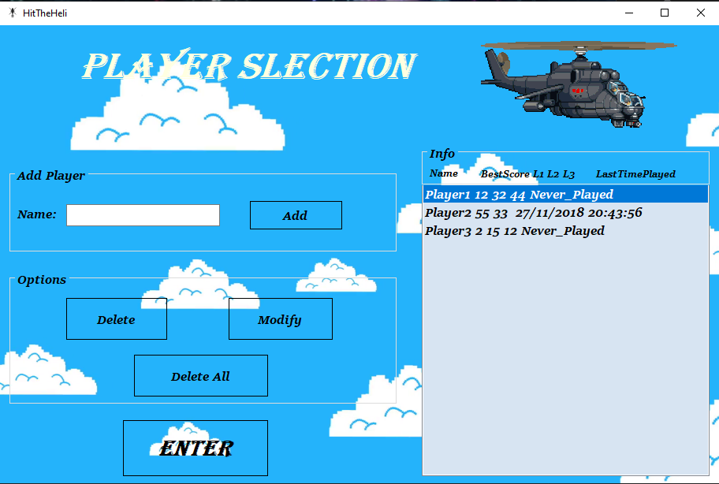
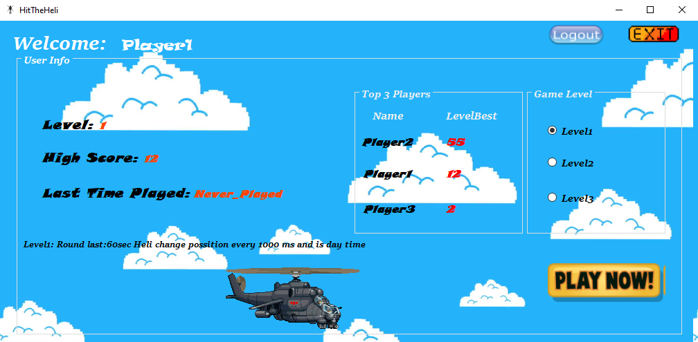
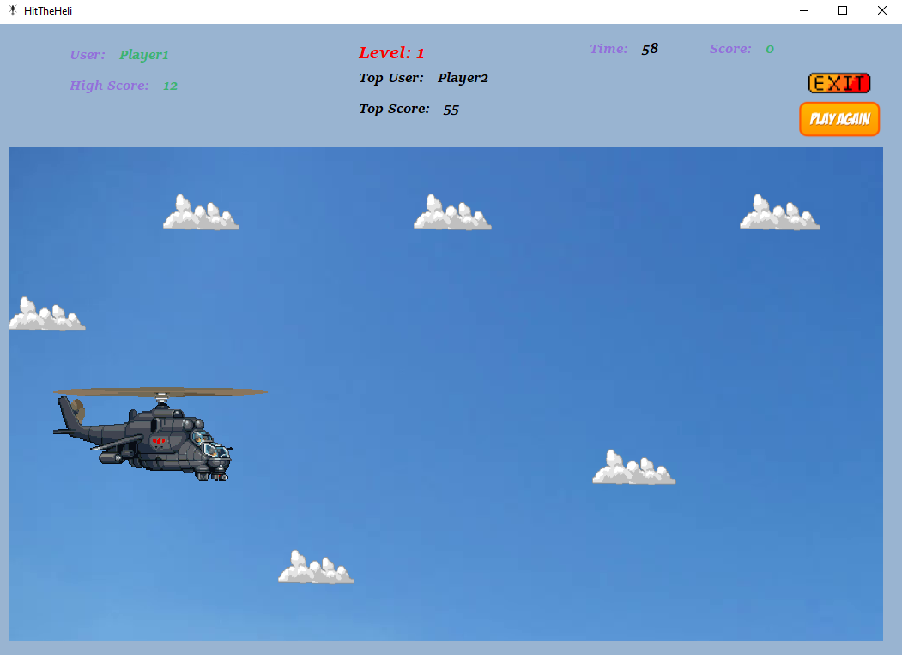
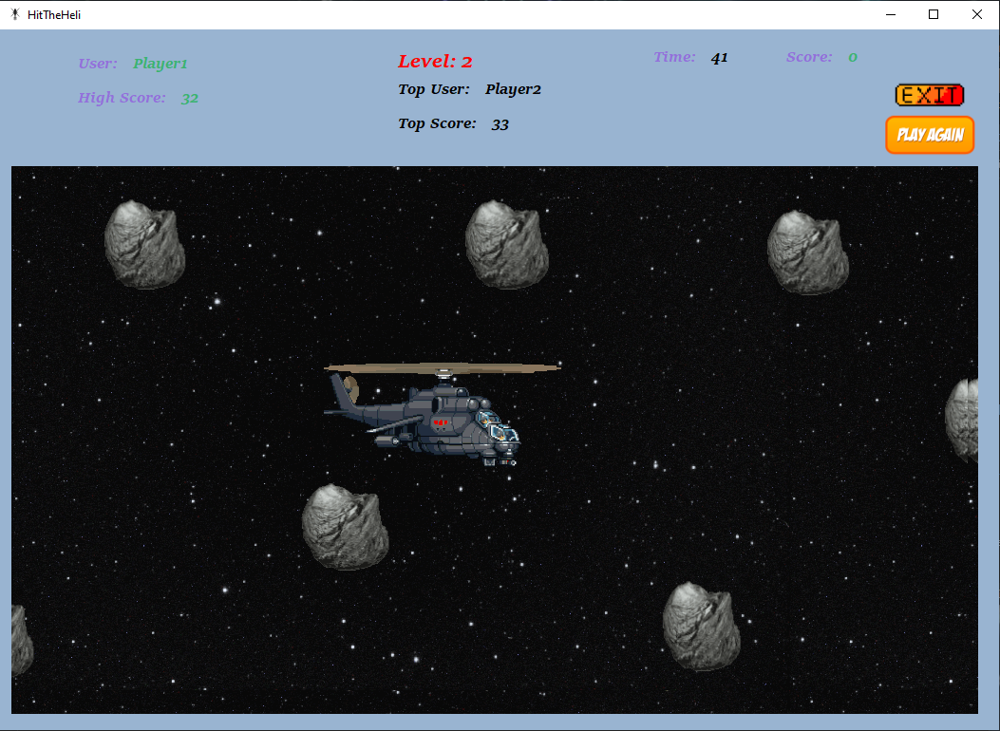

A tap/click game developed using visual studio and C#. The goal of the game is to click the helicopter as many times as possible during the available time.

Users can create , modify , delete or choose the profile they want to play from the saved profiles list.

Users can see the top 3 players with the best scores for each of the available levels of difficulty.

Users can play in total three different levels of difficulty:

  Level 1: round last 60 seconds , helicopter change position every 1000ms and the background is day time.
  
  Level 2: round last 45 seconds , helicopter change position every 700ms , the background is night time and the background objects move faster.
  
  Level 3: round last 30 seconds , helicopter change position every 400ms , the background is chaning (day/night cycle) and the background objects move even faster.
